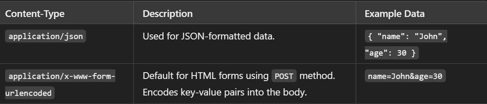

2. **Form Body Parsing** 
   - Identify the correct middleware for parsing HTML form bodies into `req.body`
   - Multiple-choice question:
     - [ `True` ] `bodyParser.urlencoded()`
     - [ ] `bodyParser.json()`
     - [ ] `bodyParser.form()`
     - [ ] `bodyParser.multipart()`

  ---

  

`bodyParser.urlencoded()` (or `express.urlencoded()` if using Express 4.16+):

- Used to parse bodies sent via HTML forms with the `Content-Type: application/x-www-form-urlencoded`.
- Encodes the form fields as key-value pairs, like `key1=value1&key2=value2`, and populates `req.body`.