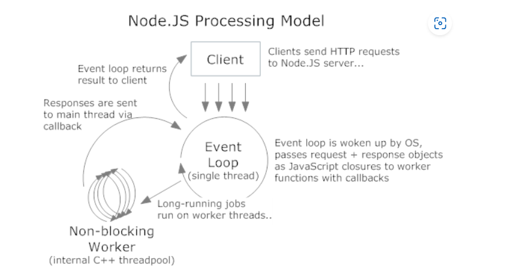

5. **Node.js Threading Model** *(2 points)*
   - Select the most accurate description of Node.js threading and event loop:
     - [ ] Node.js uses multiple threads to handle incoming requests and execute JavaScript code simultaneously.
     - [ ] Node.js follows a single-threaded model that utilizes an event loop for handling I/O operations asynchronously.
     - [ ] Node.js implements a multi-threaded architecture where each request is processed by a dedicated thread.
     - [ ] Node.js event loop handles only synchronous operations, while asynchronous operations are executed in separate threads.

---

 

#### resources
1. [stack overFlow](https://stackoverflow.com/questions/14795145/how-the-single-threaded-non-blocking-io-model-works-in-node-js)
2. [stack overFlow](https://stackoverflow.com/questions/3629784/how-is-node-js-inherently-faster-when-it-still-relies-on-threads-internally)
3. [Rob Pike - 'Concurrency Is Not Parallelism](https://vimeo.com/49718712)
4. [slides of the section](https://go.dev/talks/2012/waza.slide#1) 

 

### The correct answer is: Node.js follows a single-threaded model that utilizes an event loop for handling I/O operations asynchronously.

Explanation:

- Single-Threaded Model:
    - Node.js operates primarily on a single thread for executing JavaScript code.
    - The main thread executes all the JavaScript code in the event loop, which coordinates asynchronous operations efficiently.

- Event Loop:

    - The event loop is at the heart of Node.js. It allows Node.js to handle multiple concurrent operations without creating new threads for each task.
    - When a blocking or asynchronous operation (e.g., file I/O, network request) is encountered, the event loop delegates it to the appropriate system kernel or worker thread and continues running other tasks.

- Asynchronous I/O:

    - Node.js benefits from the non-blocking nature of asynchronous I/O operations to handle multiple requests concurrently, even though it is single-threaded.
    - For example, while waiting for a database query or file read operation to complete, the event loop processes other tasks.

- Thread Pool for Heavy Tasks:

    - Internally, Node.js uses a limited thread pool (via the libuv library) for CPU-intensive operations, such as file system operations, compression, or cryptography.
    - These tasks are executed on background threads managed by the libuv thread pool, not directly in the event loop.

---

---

 

1. "Node.js uses multiple threads to handle incoming requests and execute JavaScript code simultaneously."  
- Incorrect. JavaScript execution in Node.js is single-threaded. Only I/O operations or heavy tasks are offloaded to worker threads when needed.

2. "Node.js implements a multi-threaded architecture where each request is processed by a dedicated thread." 
- Incorrect. Node.js does not create a new thread for every request. It uses the event loop to handle requests on a single thread.

3. "Node.js event loop handles only synchronous operations, while asynchronous operations are executed in separate threads." 
- Incorrect. The event loop handles asynchronous operations by delegating them to the system or a thread pool, and resumes processing their callbacks when they are complete. It does not rely on separate threads for all asynchronous tasks.